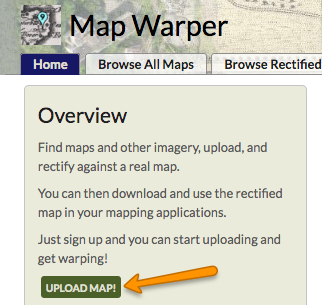
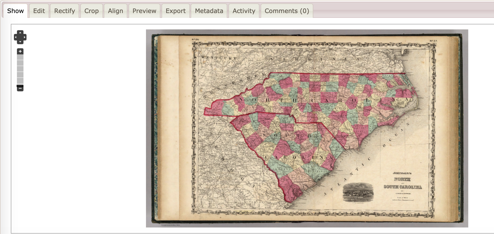
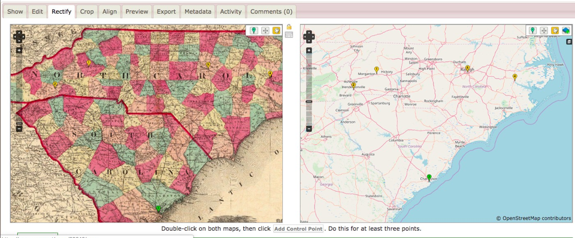
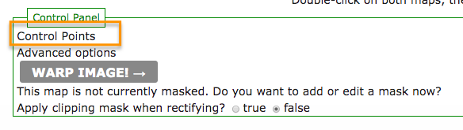
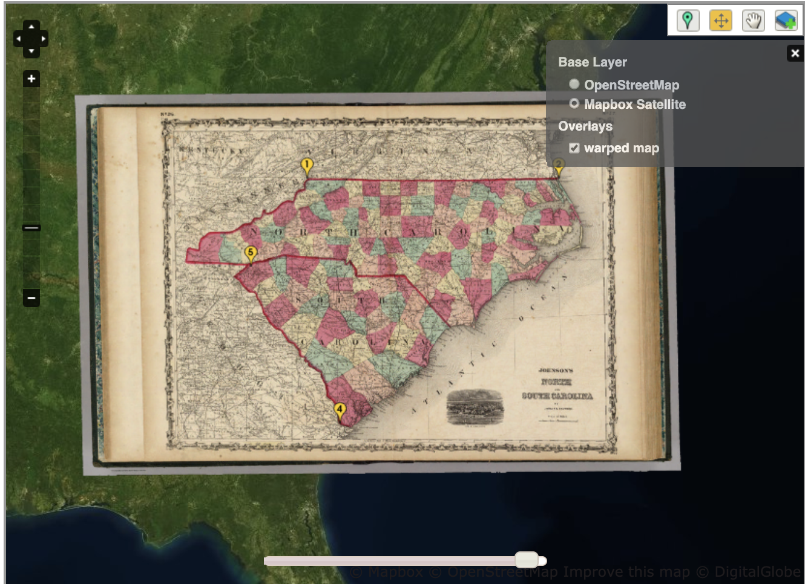
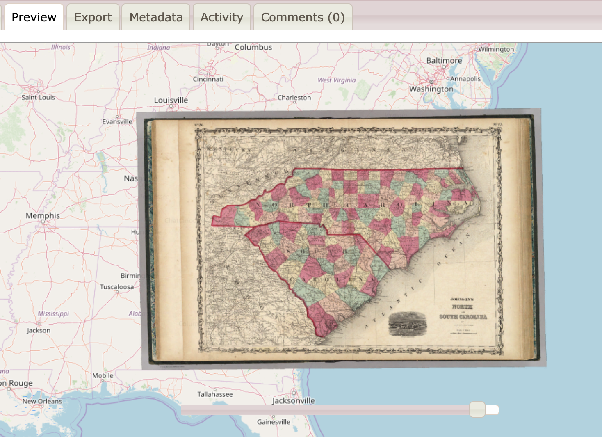

##Programming Historian Tutorial on Georeferencing and Displaying Historical Maps with Map Warper and ArcGIS online
*By Erica Hayes and Mia Partlow*

# Lesson Goals

Georeferencing is the process of assigning geographic coordinates to a scanned map or raster image. Many historians are now georeferencing historical maps in order to study how places have changed over time. In this lesson, we will take you through the steps to align geographic coordinates to a scanned historical map and show you how to share your georeferenced map online using an interactive web-based mapping platform like ArcGIS Online. While you may have already encountered the *Programming Historian* tutorial on [Georeferencing in QGIS 2.0](https://programminghistorian.org/en/lessons/georeferencing-qgis), we wanted to provide you with some examples of other entry-level georeferencing tools.

Before you begin georeferencing a scanned map, it is important to understand the locations depicted on the map, as well as the context of the creation of the historic map itself. Not all historic maps are good candidates for georeferencing. There must be enough information on the map to allow you to confidently assign latitude and longitude coordinates to it or align it with a GIS map using physical features. Often, you will need to research the location of historic places and features that no longer exist, and make an informed decision in order to identify its proper placement. Some maps may not have enough geographic information, and may become so warped when georeferenced that they are illegible or inaccurate.

The scale, resolution, and projection of a scanned map are also important considerations when choosing a historic map to georeference. Small scale maps are generally not well suited for highly detailed georeferencing and may cause problems with representing exact feature locations. When selecting or scanning a historic map for georeferencing, it is better to use a map that has been scanned at a high resolution (300 dpi or greater), so you can easily see the features on the map when zooming in and out. It is also best practice to use the same projection as the historic map in order to minimize distortion. Georeferencing a map in the wrong projection  can create a mismatch between your historical and current maps, stretching the lines, shapes, and the distance between objects. Map Warper, the tool used in this tutorial, does not provide an option to re-project your map data; if you are unable to achieve a legible map, or if you are measuring distance, you may need to use a more advanced GIS software, such as QGIS or ArcMap, which will allow you to specify the map projections. For more details on best practices for georeferencing, see [Esri’s list of recommendations](https://www.esri.com/esri-news/arcuser/spring-2014/~/media/Files/Pdfs/news/arcuser/0314/seven-best-practices.pdf).

In this tutorial, you will work with Map Warper and ArcGIS Online to create a georeferenced historical map and overlay it on top of a modern basemap to be published and interacted with on the web. Developed by Tim Waters, [Map Warper](https://mapwarper.net) is an open-source georeferencing service, written in Ruby on Rails and lets users upload scanned maps and georeference them against OpenStreetMap. [ArcGIS Online] (https://www.esri.com/en-us/arcgis/products/arcgis-online/overview) is a cloud-based mapping and analysis platform by Esri. You can use ArcGIS Online to create maps, analyze data, tell stories, and share maps online.

# Getting Started: Georeferencing your map with MapWarper.net
*You will start by uploading a map and georeferencing it using the open source online tool Map Warper. Map Warper has a variety of export options, including WMS URL and a GeoTIFF or KML file. For the purposes of this tutorial we will export the georeferenced map as map tiles and load it into to ArcGIS Online.*

## Step 1: Set up Map Warper and upload your map

1. In this tutorial we will use an [1829 map of North Carolina](https://dc.lib.unc.edu/cdm/singleitem/collection/ncmaps/id/174/rec/4) from the NC Maps Collections. Download the Large (Full resolution of stored image) version.

  * Note: Every filename in Map Warper must be unique, so you will need to give the image a new file name, such as North_Carolina_yourlastname.jpg.

2. Go to [https://mapwarper.net](https://mapwarper.net) and create an account.

3. On the Home page, click the green button labeled Upload Map to import your scanned map to Map Warper.

4. The next screen is asking for descriptive information that will make the map easier to find (also known as metadata). While only the Title field is required, it is generally best practice to provide as much information as possible, so other users can learn more about the source of your scanned map you are georeferencing. Fill in the metadata based on the information provided to you about the historical map that you’re working with. For the North Carolina map, you can find the map’s metadata below the image on the [North Carolina Maps collection site](https://dc.lib.unc.edu/cdm/singleitem/collection/ncmaps/id/174/rec/4).

5. Towards the bottom of the screen, click the Choose File button under “Upload an image file.” Navigate to the North_Carolina.jpg map that you downloaded to your computer and click Create.

## Step 2: Explore the Map Warper Interface

1. You now have your map loaded into Map Warper. The interface is organized into the following tabs:

  * Show: displays only your map image
  * Edit: allows you to edit the descriptive text (metadata)
  * Rectify: used for the georeferencing itself
  * Align: a useful tool if you are stitching together multiple maps
  * Preview: shows your map on top of a modern basemap
  * Export: gives you a variety of export options and formats

## Step 3: Georeference your map

2. Click on the Rectify tab

3. Take a moment to move the map on the right to the North Carolina region. The arrows at the top of the screen move the map slightly to the North, South, East, and West and are useful when you need to make small adjustments to the map. You can zoom with the slider or with your trackpad/mouse.

  * To move around a map, click the hand icon.
  * To add a control point, you will click the green location marker and click the place on the map where you want it to go. Note: The control point will not be permanently selected until you click the "Add Control Point" button below the maps.

4. Once you feel comfortable moving around in the maps, select your first control point. Start from the historic map and choose a location--for example, a city--that will be relatively easy to find on the modern map.

5. Then, click the green marker on the modern map and find the same location.

6. Click the Add Control Point button. Note: If you do not click the Add Control Point button, the next time you click on a map, the control point you added will move. This functionality gives you the flexibility to adjust your points while adding them, but can be confusing if you don’t realize that your point has moved because you didn’t click Add Control Point.

7. You need at least 4 or 5 points. Spread them out across your historic map--focusing on state borders and major cities is a good strategy.

8. If you need to delete a control point, click on “Control Points” in the Control Panel below the map.Selecting Control Points will display all of the points you have added, and enable you to delete any points that you want to re-do. You also have the option of changing the latitude and longitude manually.

*Note: There is an  Error value for each control point. Map Warper uses the Root Mean Square error calculation (RMS) to evaluate the transformation of the different control points. The RMS error provides a rough guide to how consistent your control points are to one another with reference to the map and assesses how distorted your map will be. High RMS error values indicate that your control points are less consistent with one another in comparison to a low RMS error value. It is generally recommended that you keep your error values low and replace or remove control points with high values. While the RMS error provides a good way to assess the transformation's accuracy, you should always reevaluate how well your image maps up to the GIS map. For more information about the RMS error, please see Esri's section on interpreting the root mean square error in their [Overview of georeferencing](https://pro.arcgis.com/en/pro-app/help/data/imagery/overview-of-georeferencing.htm#ESRI_SECTION1_61F70AE3AC6C47559B3C03C74F093505)*

10. When you have enough points and think they are distributed well across your historic map, click Warp Image! at the bottom of the page. Georeferencing maps takes practice. You may find that your rectified map creates an unreadable warped map. We encourage you to try steps 7-9 again, taking into account best practices for georeferencing mentioned above, such as identifying major cities, roads, streams, and rivers that you can identify with confidence.

11. You will now see the map layered on top of the OpenStreetMap.

13. You can choose to view a satellite image basemap or the regular OpenStreetMap layer we’ve been using.

14. Click the Preview tab for a larger view of the georeferenced map. Changing the opacity can give you a sense of how accurate your georeferencing is.

15. Another option Map Warper provides is cropping the map down. Click on the

## Step 2: Export your map

16. Click the Export tab

17. Choose “Download Rectified GeoTIFF.” You can use this GeoTIFF to publish your map online, as we’ll show you in the next activity, or you can upload it into GIS software programs such as QGIS or ArcGIS.

## Step 3: Loading your map into ArcGIS Online
*ArcGIS Online has public accounts available, which allow you to create maps and Story Maps that are shareable on the web. Using the Mapbox Integration URL, you can also bring your historic maps into other platforms such as Carto and Tableau, as well as any web maps you create, for example using Leaflet.js.*

1. Login to www.arcgisonline.com and create a public account.
2. Once you are logged in, click on Map. This will open a new, blank map.
3. Click the Add drop-down menu and choose "Add layer from Web."

4. Choose "A tile layer"

5. In the URL field, enter the Integration URL you copied from Mapbox.  In the Title and Credits, you will enter your own information. For example, Title: “North Carolina 1829” and Credits: “Georeferenced by [your name here]”. Click "Add Layer"

6. Save your map. Add your title and at least one tag (example: ‘North Carolina’). Save.
7. Your Georeferenced Map in ArcGIS online should look like the following image. If you want to make your map more transparent, go back into Mapbox and click on your georeferenced map layer, and adjust the "Raster opacity."

8. Click Share in the top menu above the map. Maps created in public accounts can remain private, or be shared with "Everyone (public)". Once you choose to share with Everyone, you will be able to click "Embed in Website" to get HTML code for embedding your map, or you can ‘Create a Web App’ to use one of ArcGIS Online’s templates for viewing and analyzing geographic data, including Story Maps.
